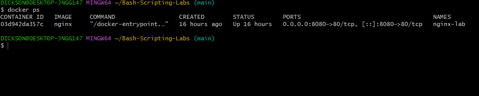
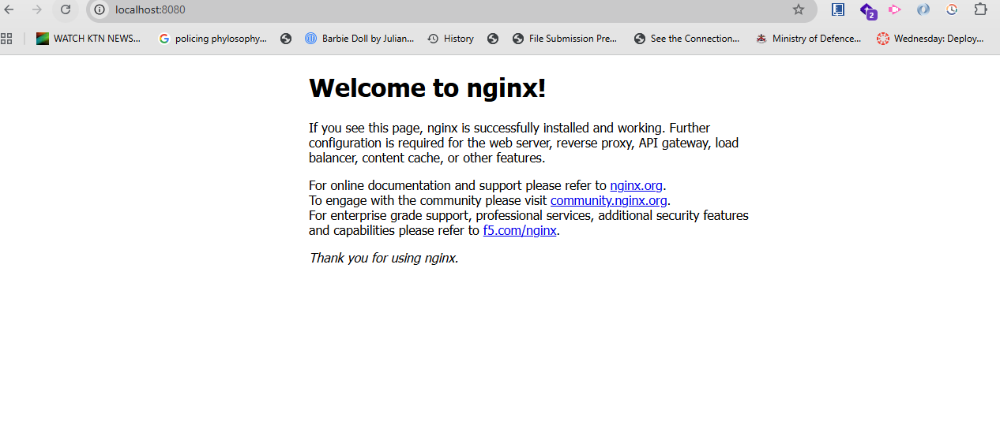

# Bash-Scripting-Labs
The following repository contains bash scripting labs scenarios
# Lab 1 — Production Server Recovery
***Scenario***

Nginx crashes at midnight

Create automation that 

-Detects failure

-Restarts nginx

-Logs issues

-Send notifications

# Solution

***Step 1:Start a nginx container****

***Confirm if nginx container has been created***

***Confirm is nginx is active***

